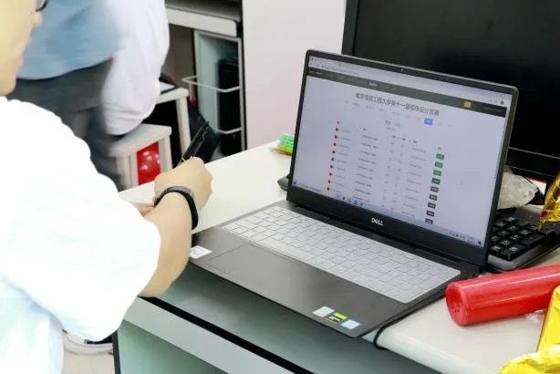

# Thinkspirit介绍
    Thinkspirit主要参加acm-icpc等算法竞赛，并负责开发Online Judge（题目评测系统）,
    组织校赛等工作。闲暇时也参加蓝桥杯，并获得了不俗的成绩。
    原先将中美三楼的实验室作为训练场地，现在在计算机楼一楼的一间会议室训练。训练氛围欢快，但对态度要求较严格。
## 关于ACM
    ACM国际大学生程序设计竞赛的历史可以上溯到1970年，当时在美国德克萨斯A&M大学举办了首届比赛。当时的主办方是the Alpha Chapter of the UPE Computer Science Honor Society。作为一种全新的发现和培养计算机科学顶尖学生的方式，竞赛很快得到美国和加拿大各大学的积极响应。1977年，在ACM计算机科学会议期间举办了首次总决赛，并演变成为一年一届的多国参与的国际性比赛。  
    
    我校自2013年参加ACM比赛以来，先后实现了区域赛铜奖和银奖的突破。并成功入围CCPC的决赛。
    近年我校部分奖项： 
    2017年5月 JSCPC铜奖
    2018年5月 JSCPC铜奖*2
    2019年5月 JSCPC银奖+铜奖*2
    2019年秋，于宁夏和南京的ICPC亚洲区域赛获得了两枚银牌。

部分合影留念与奖牌特写

  

    2019年12月，在ccpc-final的决赛和icpc-ec-final的决赛中都获得了铜牌。

    ACM竞赛对学生锻炼价值极大，获奖的ACM队员均进入了一流的IT企业，我校部分ACM队员的毕业去向：
        13级耿祥，我校第一任ACM队长，今年即将进入南大读博
        17级施博文，于阿里云实习
        17级陈靖宇，于阿里云实习
        ACM可以有效提升算法设计、逻辑推理、数学建模、编程实现和计算机系统能力，培养团队合作意识、挑战精神和创新潜力
    
## OJ开发：   
    Thinkspirit同时负责校内评测系统(OJ)的开发与维护，相较埋头刷题来说，开发oj可以锻炼工程能力，是大有裨益的。
[oj连接(暑假维护中...暂不开放)](http://acm.nuist.edu.cn)
    
    OJ系统主要有做题，评测的功能，即出题后，做题者写出代码(长则一百行，短则20行)，提交，又后端编译运行做题者的代码并和测试数据比对，完全一致时会返回Ac(Accept)，也就是做对了，错误时会因为类型错误而返回不同内容(如WA答案错误,TLE运行超时,MLE内存超出要求范围,CE无法编译)等等。 此外还是举办比赛（如新生赛，校赛），和一些期末考试（如程序设计实践）的考试平台。

## 承办校赛
    Thinkspirit负责校赛的出题，维护考场秩序和讲题等工作。
    校赛前会组织成员出题，不能出太难的题也不能出1+1=2的简单题，但是又要有难度梯度以保证区分度，不然有可能出现大家全部做完或者大家全部爆零。所以需要较长时间准备。
    校赛结束后会有ThinkSpirit讲题环节，同时会特供由ThinkSpirit亲自编写，亲自修改官方题解。

 图为第十一届校赛场景 

## 平时训练

    暑期参加杭电多校赛

 积分截图 

    
    平时在空余时间会组织专题训练与补题

 平时的训练 

 大家学习过程中的总结 

---

## 我们需要什么样的人
    代码能力，思维能力，数理基础，动手能力强。同时要求有一定对程序设计的热情与耐心。
